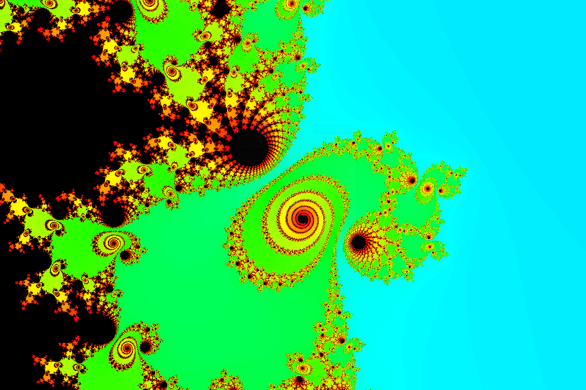

# cuda-fractal

Fractal viewer Qt app powered by CUDA

## installation

- Install QT5 (e.g. `apt install qt5-default`)

- Download and install [NVIDIA CUDA toolkit](https://docs.nvidia.com/cuda/cuda-installation-guide-linux/index.html)

- Set `CUDA_HOME` environment variable to CUDA install path

- Generate a makefile with `qmake`

- Compile the binary with `make`

## execution

Run `./cuda-fractal` to launch the app. 

## TODOs:

- Compute HSV->RGB on GPU
- Increase precision for zooming
- Optimize CUDA code